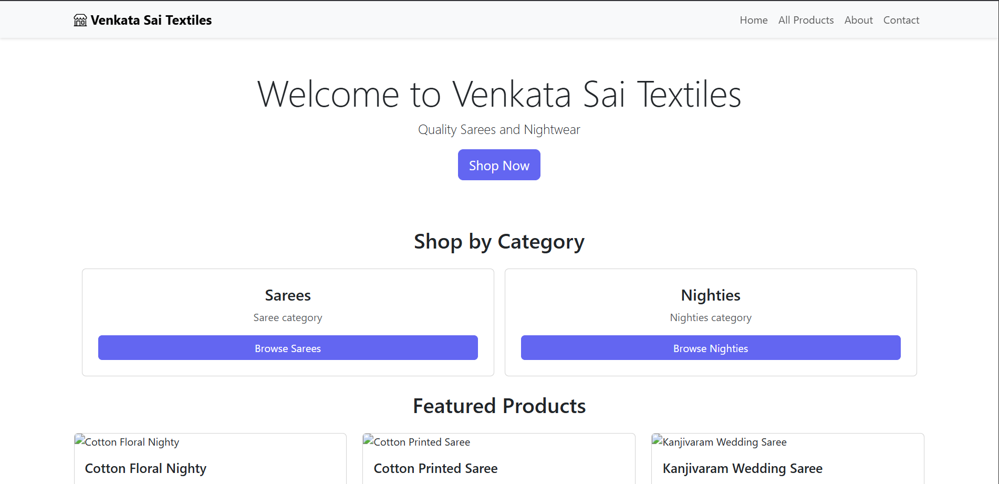
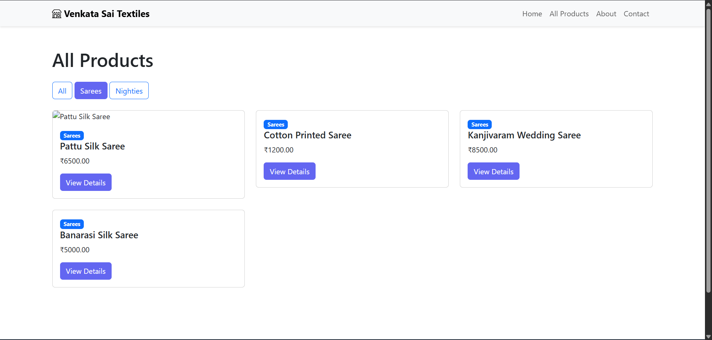
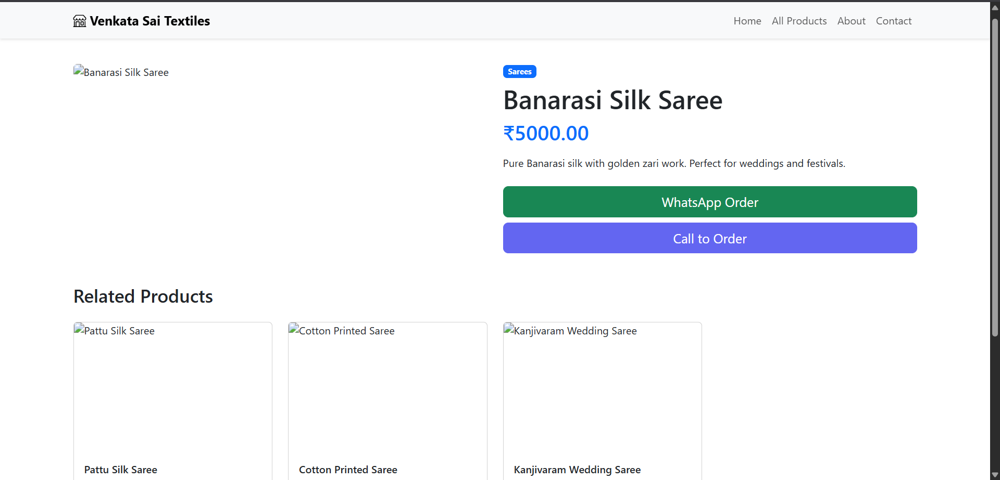
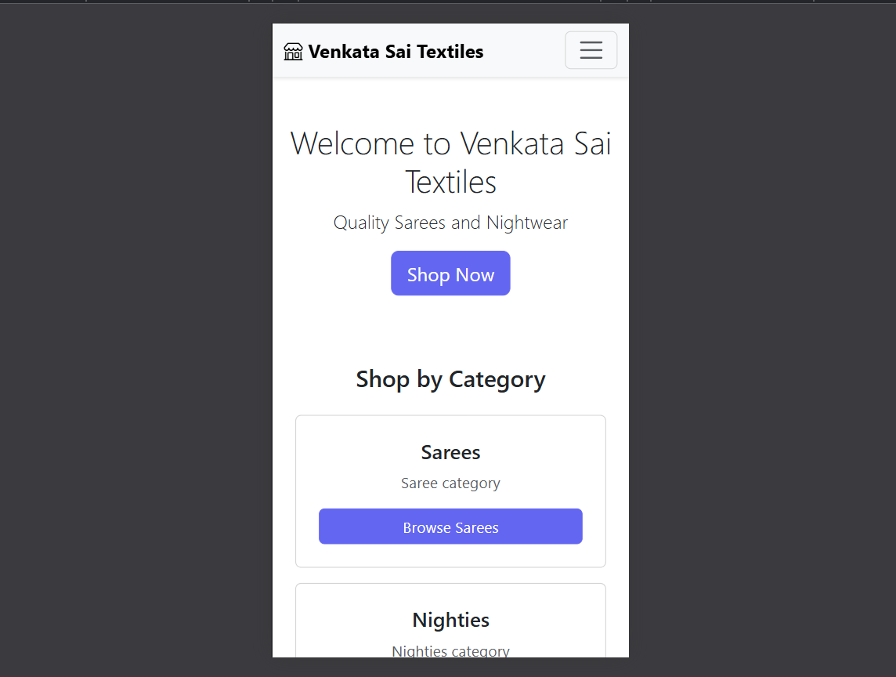

# Family Shop Website

E-commerce website for saree and nightwear shop built with Django and Bootstrap.

## Live Demo
Website runs on localhost - screenshots below

## Features

- 🛍️ Product catalog with 10+ products
- 📂 Category filtering (Sarees & Nighties)
- 📱 Mobile-responsive Bootstrap design
- 💬 WhatsApp integration for orders
- 📞 Direct call buttons
- ⭐ Featured products section
- 👔 Clean, professional UI
- 🔧 Django admin panel for product management

## Tech Stack

- **Backend:** Django 
- **Frontend:** Bootstrap 5.3, Bootstrap Icons
- **Database:** SQLite
- **Python:** 3.x

## Models

### Category
- name, description

### Product
- name, category (ForeignKey)
- description, price
- image_url, available, featured
- timestamps (created_at, updated_at)

## Setup Instructions
```bash
# Clone repository
git clone https://github.com/sainath-banala/shop-website.git
cd shop-website

# Create virtual environment
python -m venv venv
source venv/bin/activate  # Windows: venv\Scripts\activate

# Install Django
pip install django

# Run migrations
python manage.py migrate

# Create superuser
python manage.py createsuperuser

# Run server
python manage.py runserver
```

Access:
- Website: http://127.0.0.1:8000/
- Admin: http://127.0.0.1:8000/admin/

## Project Structure
```
shop-website/
├── shop/
│   ├── models.py      # Category & Product models
│   ├── views.py       # 6 views (home, products, detail, etc.)
│   ├── urls.py        # URL routing
│   └── admin.py       # Admin customization
├── templates/shop/
│   ├── base.html      # Base template with navbar/footer
│   ├── home.html
│   ├── product_list.html
│   ├── product_detail.html
│   ├── about.html
│   └── contact.html
└── manage.py
```

## What I Learned

### Django Skills
- Model relationships (ForeignKey with related_name)
- Admin customization (list_display, list_filter, list_editable)
- Template inheritance and blocks
- URL routing with namespaces
- QuerySet filtering and ordering
- Passing context to templates

### Bootstrap & Frontend
- Bootstrap 5 grid system (rows, columns)
- Card components for product display
- Responsive navbar with mobile toggle
- Button styling and variants
- Bootstrap Icons integration
- Mobile-first responsive design

### Real-World Application
- Built for actual business use case
- Contact integration (WhatsApp pre-filled messages)
- Category-based product filtering
- Featured products highlighting
- Admin panel for non-technical family members

## Key Features Explained

**Category Filtering:**
Products can be filtered by clicking Sarees/Nighties buttons - uses Django QuerySets with category ForeignKey relationship.

**WhatsApp Integration:**
Uses `wa.me` API with pre-filled message including product name and price for easy ordering.

**Admin Panel:**
Customized with list_display for quick overview, list_filter for category/availability filtering, and list_editable for quick status updates.

**Responsive Design:**
Bootstrap grid system ensures website looks good on mobile, tablet, and desktop without custom media queries.

## Future Improvements

- [ ] Add shopping cart
- [ ] User authentication
- [ ] Image upload (not just URLs)
- [ ] Search functionality
- [ ] Product reviews
- [ ] Deploy to Railway/Render
- [ ] Payment gateway
- [ ] Inventory tracking

## Screenshots

### Home Page


### Product List


### Product Detail


### Mobile View


## Author

Sainath Banala
- GitHub: [@sainath-banala](https://github.com/sainath-banala)

## Related Projects

- [Django Task API](https://github.com/sainath-banala/tasks-api) - REST API built with Django REST Framework

---